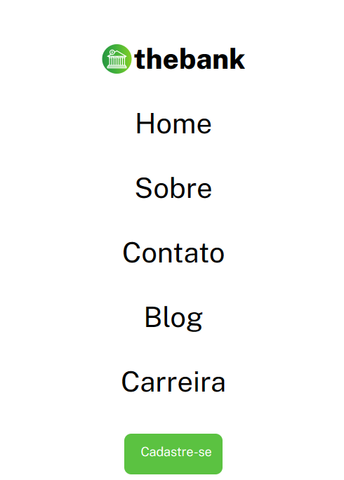

# Menu Responsivo com Flex-box

## Sobre o Projeto

Exercício de HTML e CSS Avançado feito no Curso DevQuest para aprimorar as habilidades com flex-box, onde foi construido um menu de site responsivo. A ferramenta Figma foi usada para visualizar os estilos de fonte de um elemento e seus espaçamentos e também no download de imagens.

## Tecnologias Utilizadas

                 
## Imagens do Projeto

### Desktop

### Mobile

